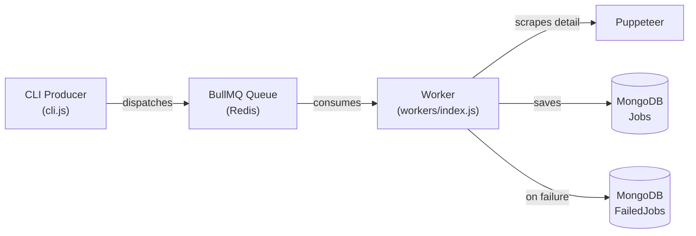

# BullMQ Integration – Walkthrough

## Architecture



## Files Changed

| File | Action | Purpose |
|------|--------|---------|
| [queue.js](file:///Users/avijit/Projects/NaukriScrap/backend/src/config/queue.js) | **NEW** | Redis connection + BullMQ Queue factory |
| [FailedJob.js](file:///Users/avijit/Projects/NaukriScrap/backend/src/models/FailedJob.js) | **NEW** | Schema for dead-letter / fallback jobs |
| [jobProcessor.js](file:///Users/avijit/Projects/NaukriScrap/backend/src/workers/jobProcessor.js) | **NEW** | Core worker logic: scrape detail, match, save |
| [index.js](file:///Users/avijit/Projects/NaukriScrap/backend/src/workers/index.js) | **NEW** | Worker entry-point with graceful shutdown |
| [Job.js](file:///Users/avijit/Projects/NaukriScrap/backend/src/models/Job.js) | **MOD** | Added `matchPercentage` field |
| [cli.js](file:///Users/avijit/Projects/NaukriScrap/backend/src/cli.js) | **MOD** | Replaced `scrapeAndSave` with [scrapeAndDispatch](file:///Users/avijit/Projects/NaukriScrap/backend/src/cli.js#58-117) |
| [package.json](file:///Users/avijit/Projects/NaukriScrap/backend/package.json) | **MOD** | Added `"worker"` script, `bullmq` + `ioredis` deps |

## How to Run

> [!IMPORTANT]
> Redis must be running locally (`redis-server`) or set `REDIS_URL` in `.env`.

**Terminal 1 – Start the worker:**
```bash
cd backend && npm run worker
```

**Terminal 2 – Dispatch jobs:**
```bash
cd backend && npm run start        # uses config.json keywords
# or
cd backend && npm run scrape -- -k "react developer" -p 2 -l
```

## Verification

- All 6 files pass `node -c` syntax checks ✅
- Worker connects to Redis + MongoDB and listens on queue `naukri-job-scraping`
- Producer dispatches basic job cards; worker handles detail scraping, match % calculation, and DB upsert
- Failed jobs are stored in the `failedjobs` MongoDB collection with `errorReason`
