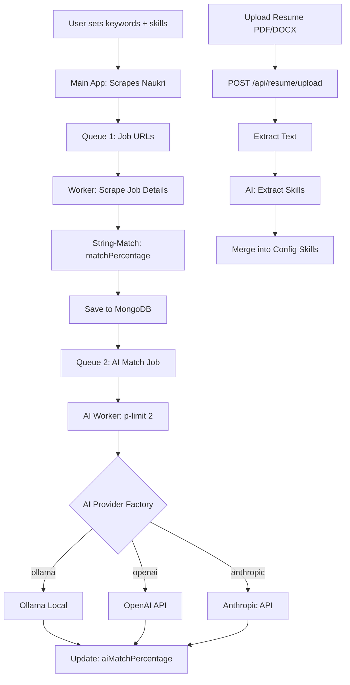

# AI-Powered Job Match & Resume Skill Extraction — Implementation Summary

## New Files Created (8 files)

### AI Module (`src/ai/`)

| File | Purpose |
|------|---------|
| [prompts.js](file:///Users/avijit/Projects/NaukriScrap/backend/src/ai/prompts.js) | Centralized prompt builders: `buildMatchPrompt()` and `buildExtractPrompt()` |
| [AIProviderFactory.js](file:///Users/avijit/Projects/NaukriScrap/backend/src/ai/AIProviderFactory.js) | Strategy + Factory pattern — `createAIProvider(settings)` returns correct provider |
| [providers/BaseAIProvider.js](file:///Users/avijit/Projects/NaukriScrap/backend/src/ai/providers/BaseAIProvider.js) | Abstract base class defining interface contract |
| [providers/OllamaProvider.js](file:///Users/avijit/Projects/NaukriScrap/backend/src/ai/providers/OllamaProvider.js) | Local Ollama via REST (`/api/generate` with JSON mode) |
| [providers/OpenAIProvider.js](file:///Users/avijit/Projects/NaukriScrap/backend/src/ai/providers/OpenAIProvider.js) | OpenAI Chat Completions with `json_object` response format |
| [providers/AnthropicProvider.js](file:///Users/avijit/Projects/NaukriScrap/backend/src/ai/providers/AnthropicProvider.js) | Anthropic Messages API with markdown fence stripping |

### Queue & Worker

| File | Purpose |
|------|---------|
| [queues/aiMatchQueue.js](file:///Users/avijit/Projects/NaukriScrap/backend/src/queues/aiMatchQueue.js) | Queue 2 definition + `dispatchAIMatchJob()` helper |
| [workers/aiMatchWorker.js](file:///Users/avijit/Projects/NaukriScrap/backend/src/workers/aiMatchWorker.js) | Queue 2 consumer — AI match scoring with `p-limit(2)` |

### Route & Utility

| File | Purpose |
|------|---------|
| [routes/resumeUpload.js](file:///Users/avijit/Projects/NaukriScrap/backend/src/routes/resumeUpload.js) | `POST /api/resume/upload` — PDF/DOCX → AI skill extraction |
| [utils/encryption.js](file:///Users/avijit/Projects/NaukriScrap/backend/src/utils/encryption.js) | AES-256-CBC encrypt/decrypt for API keys |

---

## Files Modified (7 files)

### [models/Job.js](file:///Users/avijit/Projects/NaukriScrap/backend/src/models/Job.js)
Added 3 new fields to schema (non-breaking, nullable):
```diff
+ aiMatchPercentage: { type: Number, default: null }
+ aiReasoning:       { type: String, default: null }
+ aiMatchStatus:     { type: String, default: 'pending', enum: ['pending', 'done', 'failed'] }
```

### [models/ScraperConfig.js](file:///Users/avijit/Projects/NaukriScrap/backend/src/models/ScraperConfig.js)
Added AI provider settings (non-breaking):
```diff
+ ai_provider:  { type: String, default: 'ollama', enum: ['ollama', 'openai', 'anthropic'] }
+ ai_model:     { type: String, default: 'qwen2.5:7b' }
+ ai_api_key:   { type: String, default: null }  // stored encrypted
```

### [workers/jobProcessor.js](file:///Users/avijit/Projects/NaukriScrap/backend/src/workers/jobProcessor.js)
- Added `dispatchAIMatchJob` import
- Job document now includes `aiMatchPercentage: null`, `aiReasoning: null`, `aiMatchStatus: 'pending'`
- After existing DB upsert: dispatches to Queue 2 (wrapped in try/catch, non-fatal)
- **Existing `matchPercentage` logic is completely untouched**

### [workers/index.js](file:///Users/avijit/Projects/NaukriScrap/backend/src/workers/index.js)
- Added `startAIMatchWorker()` import and call
- Graceful shutdown now closes both scraping and AI workers

### [app.js](file:///Users/avijit/Projects/NaukriScrap/backend/src/app.js)
- Added `require('./routes/resumeUpload')` import
- Registered `app.use('/api/resume', resumeUploadRoutes)`

### [controllers/configController.js](file:///Users/avijit/Projects/NaukriScrap/backend/src/controllers/configController.js)
- Added destructuring for `ai_provider`, `ai_model`, `ai_api_key`
- Added validation for `ai_provider` enum
- API key is encrypted via `encrypt()` before passing to `updateConfig`

### [services/configService.js](file:///Users/avijit/Projects/NaukriScrap/backend/src/services/configService.js)
- `getConfig()` now includes `ai_provider`, `ai_model`, `ai_api_key_set` (boolean, never exposes actual key)
- `updateConfig()` response includes the same AI fields

---

## Architecture Flow



---

## npm Packages Installed

```
p-limit, pdf-parse, mammoth
```

## Environment Variables Added

```
OLLAMA_URL=http://localhost:11434
OLLAMA_MODEL=qwen2.5:7b
AI_KEY_ENCRYPTION_SECRET=<32-char-random-string>
```

---

## Ollama Setup

```bash
# Install Ollama (macOS)
brew install ollama

# Pull recommended model
ollama pull qwen2.5:7b

# Start server
ollama serve
```

> [!IMPORTANT]
> Ollama must be running before starting the worker. The AI worker will retry failed jobs 3 times with exponential backoff.

## API Endpoints

| Method | Endpoint | Description |
|--------|----------|-------------|
| `POST` | `/api/resume/upload` | Upload PDF/DOCX resume → AI extracts skills → merges into config |
| `PUT` | `/api/config` | Now accepts `ai_provider`, `ai_model`, `ai_api_key` fields |
| `GET` | `/api/config` | Now returns `ai_provider`, `ai_model`, `ai_api_key_set` (boolean) |

## Design Decisions

1. **No `userId` concept** — The existing codebase uses a singleton `ScraperConfig` with `configId: 'default'`. AI settings are stored in the same singleton, maintaining architectural consistency.
2. **Non-fatal Queue 2 dispatch** — If dispatching to Queue 2 fails, the scraping job still succeeds. This ensures scraping is never blocked by AI infrastructure issues.
3. **p-limit ESM dynamic import** — `p-limit` v6+ is ESM-only, so we use `await import('p-limit')` and cache it.
4. **API key never exposed** — `getConfig()` returns `ai_api_key_set: true/false`, never the actual encrypted value.
